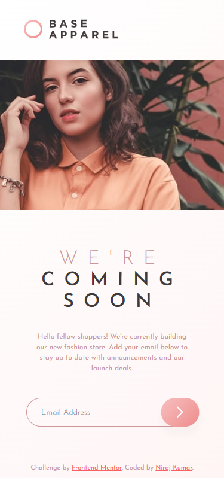

# Base Apparel coming soon page solution

This is a solution to the [Base Apparel coming soon page challenge on Frontend Mentor](https://www.frontendmentor.io/challenges/base-apparel-coming-soon-page-5d46b47f8db8a7063f9331a0).

## Table of contents

-   [Overview](#overview)
    -   [The challenge](#the-challenge)
    -   [Screenshot](#screenshot)
    -   [Links](#links)
-   [My process](#my-process)
    -   [Built with](#built-with)
    -   [What I learned](#what-i-learned)
    -   [Useful resources](#useful-resources)
-   [Author](#author)

## Overview

### The challenge

Users should be able to:

-   View the optimal layout for the site depending on their device's screen size
-   See hover states for all interactive elements on the page
-   Receive an error message when the `form` is submitted if:
    -   The `input` field is empty
    -   The email address is not formatted correctly

### Screenshot

### Links

-   Solution URL: [Check My Solution on Frontend Mentor](https://www.frontendmentor.io/profile/niraj-kumar-r)
-   Live Site URL: [Base Apparel](https://niraj-base-apparel.netlify.app/)

## My process

### Built with

-   Semantic HTML5 markup
-   CSS custom properties
-   CSS Grid
-   Mobile-first workflow
-   Constraint Validation API

### What I learned

-   Learned about form validation with HTML5 constraints as well as the Constraint Validation API built-in in most browsers.

### Useful resources

-   [Client Side Validation - By MDN](https://developer.mozilla.org/en-US/docs/Learn/Forms/Form_validation) - This page by MDN is probably the best resource available online for this project.

## Author

<!-- -   Website - [Add your name here](https://www.your-site.com) -->

-   Linked In - [@niraj-kumar-r](https://www.linkedin.com/in/niraj-kumar-r/)
-   Frontend Mentor - [@niraj-kumar-r](https://www.frontendmentor.io/profile/niraj-kumar-r)
-   Twitter - [@niraj_kumar_r](https://www.twitter.com/niraj_kumar_r)
